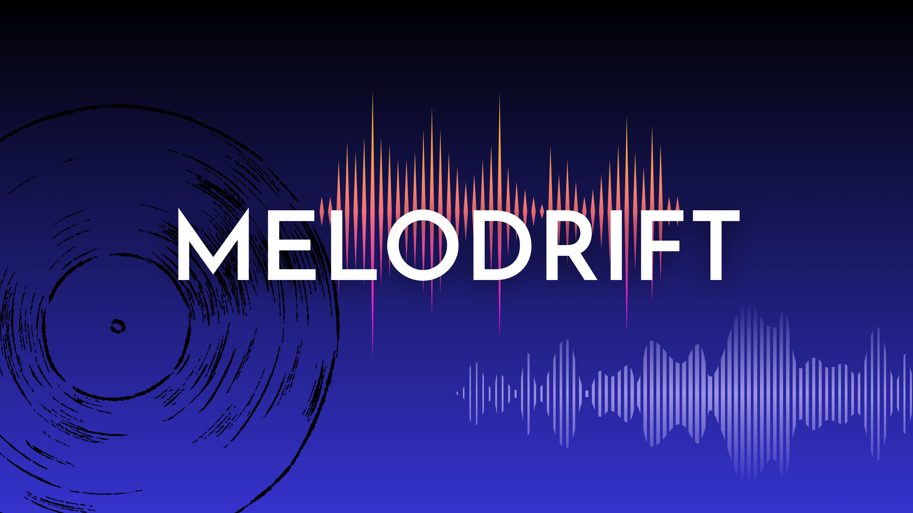

# 🎵 Melodrift – Lofi Music Player

A beautiful, modern lofi music player built with Next.js 14, TypeScript, and Tailwind CSS.  
Enjoy curated lofi channels, ambient sound effects, and a retro-inspired interface — all in your browser.



---

## ✨ Features

- **Lofi Radio Channels:** Switch between curated lofi YouTube streams.
- **Ambient Sound Effects:** Layer rain, vinyl crackle, and more for the perfect vibe.
- **Custom Channels:** Add your own favorite streams.
- **Responsive Design:** Looks great on desktop and mobile.
- **Theme Support:** Light/dark mode and custom accent colors.
- **Retro UI:** Inspired by classic music players, with modern touches.
- **Persistent Settings:** Your preferences are saved automatically.

---

## 🚀 Getting Started

### 1. Clone the repository

```bash
git clone https://github.com/botprogrammer/melodrift.git
cd melodrift
```

### 2. Install dependencies

```bash
yarn install
# or
npm install
```

### 3. Run the development server

```bash
yarn dev
# or
npm run dev
```

Visit [http://localhost:3000](http://localhost:3000) to see the app in action.

---

## 🛠️ Tech Stack

- [Next.js 14](https://nextjs.org/)
- [React 18](https://react.dev/)
- [TypeScript](https://www.typescriptlang.org/)
- [Tailwind CSS](https://tailwindcss.com/)
- [React Player](https://github.com/cookpete/react-player)
- [Lucide Icons](https://lucide.dev/)
- [React Icons](https://react-icons.github.io/react-icons/)

---

## 🧑‍💻 Contributing

Contributions are welcome!  
Feel free to open issues, suggest features, or submit pull requests.

1. Fork the repo
2. Create your feature branch (`git checkout -b feature/your-feature`)
3. Commit your changes (`git commit -m 'Add amazing feature'`)
4. Push to the branch (`git push origin feature/your-feature`)
5. Open a pull request

---

## 🙏 Acknowledgements

- Inspired by the lofi community and classic music player UIs.
- Built with [Next.js](https://nextjs.org/) and [Tailwind CSS](https://tailwindcss.com/).

---

Enjoy the vibes!  
[GitHub Repo](https://github.com/botprogrammer/melodrift)
